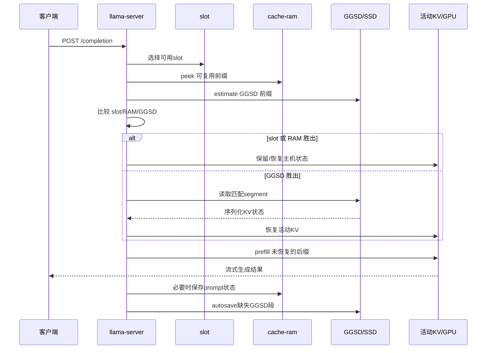
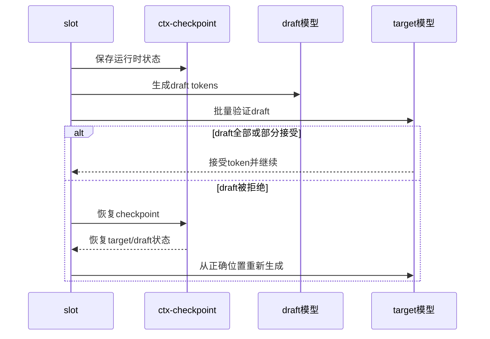

# GGSD/SSD Cache、Cache RAM 与 Context Checkpoints 对比

本文对比 `llama-server` 中三个容易混淆的状态复用机制：

- GGSD/SSD prompt cache：磁盘持久化的 prompt/KV 前缀缓存；
- `--cache-ram`：进程内主机内存 prompt cache；
- `--ctx-checkpoints`：每个 slot 的进程内运行时上下文检查点。

> 结论先行：三者不是同一种缓存，也不是简单的“三级 GPU cache”。活动 KV 才是推理时直接使用的 context；checkpoint 和 cache-ram 的状态对象主要以主机内存中的序列化字节保存；GGSD 最终保存在磁盘。

## 1. 一张图看懂

```text
                    新请求 prompt
                          |
                          v
             +---------------------------+
             | 选择 slot / 比较可复用前缀 |
             +---------------------------+
                |          |          |
                |          |          |
       slot 当前 KV   cache-ram      GGSD/SSD
       (活动状态)      (主机RAM)       (磁盘)
                \          |          /
                 \         |         /
                  +-----------------+
                  | 选择一个最优来源 |
                  +-----------------+
                          |
                          v
             恢复/保留活动 KV，继续 prefill
                          |
                          v
                    GPU/统一KV推理
```

三种机制的定位：

```text
GPU/统一 KV cache
  当前正在运行的序列；推理直接读取

ctx-checkpoint
  当前 slot 的运行时回滚点；进程内、主机内存快照

cache-ram
  多个 prompt 状态的进程内缓存；主机内存、LRU 淘汰

GGSD/SSD
  可跨请求、跨 slot、跨进程复用的持久化缓存；磁盘文件
```

## 2. 核心对比表

| 维度 | GGSD/SSD prompt cache | `--cache-ram` | `--ctx-checkpoints` |
|---|---|---|---|
| 主要目标 | 跨请求/重启持久化复用 prompt 前缀 | 进程内复用多个 prompt 状态 | 当前 slot 运行时快速回滚/恢复 |
| 典型位置 | SSD/文件系统 | 主机 RAM | 主机 RAM 中的序列化状态 |
| 是否直接作为活动 KV 使用 | 否，先读盘再恢复到 context | 否，先加载状态再恢复到 context | 否，先加载快照再恢复到 context |
| 生命周期 | 可跨进程、跨重启 | 仅当前进程 | 当前进程、当前 slot |
| 共享范围 | 内容寻址，可跨 slot/session 共享 | server 内多个 slot 可竞争复用 | 单个 slot 的检查点队列 |
| 容量参数 | `--prompt-cache-ssd-max-mib`（可选） | `--cache-ram N`，MiB | `--ctx-checkpoints N`，数量 |
| 距离参数 | `--prompt-cache-ssd-min-prefix`、`--prompt-cache-ssd-margin` | 内部 LCP/容量/LRU 逻辑 | `--checkpoint-min-step`，token |
| 典型命中单位 | 标准模式每 256 token 一个 segment | 一个已保存 prompt 状态 | 一个运行时状态快照 |
| I/O 成本 | 真实磁盘读取/写入 | 内存复制 | 内存状态复制/恢复 |
| 能否替代另两者 | 不能 | 不能完全替代 checkpoint | 不能替代持久化 cache |
| 关闭后主要代价 | 跨重启和跨进程失去磁盘复用 | 进程内 prompt 重算增加 | 回滚/恢复可能重算更多 token |

## 3. 三种机制的运行时边界

### 3.1 活动 KV：推理真正使用的状态

当前请求的 KV cache 位于 llama context 的活动 KV memory 中。根据后端和配置，它可能使用 GPU VRAM，或在启用 unified memory 时由 ROCm/HIP 在 GPU memory 与系统内存之间管理。

```text
prompt token
    -> decode/prefill
    -> 活动 KV cache
    -> 后续生成直接读取
```

`--ctx-size`、`--parallel`、`--kv-unified` 主要影响这个活动 context/KV pool 的大小和序列组织方式。

这与下面三种“状态保存/复用”机制不同：后者保存的是可以重新加载的状态表示，不是额外的一套永久活动 GPU KV。

### 3.2 Context checkpoint：当前 slot 的运行时快照

`common_prompt_checkpoint` 的核心成员是：

```cpp
std::vector<uint8_t> data_tgt;
std::vector<uint8_t> data_dft;
std::vector<uint8_t> data_spec;
```

创建 checkpoint 时，服务端从 target/draft context 导出序列化状态：

```text
活动 context/KV
    -> llama_state_seq_get_data_ext()
    -> std::vector<uint8_t>
    -> slot.prompt.checkpoints
```

恢复时反向加载：

```text
slot.prompt.checkpoints
    -> llama_state_seq_set_data_ext()
    -> 活动 context/KV
```

因此，checkpoint 不是 GPU memory 中预留的第二套 KV cache。它主要是**主机内存中的进程内状态快照**。启用了 `GGML_HIP_ENABLE_UNIFIED_MEMORY=1` 也不会改变这个代码层面的事实；统一内存可能改变活动 backend allocation 的物理驻留，但 `std::vector<uint8_t>` 仍是主机侧对象。

### 3.3 Cache RAM：多个 prompt 状态的主机内存缓存

`--cache-ram N` 创建 server 级 prompt cache。每条缓存状态包括：

```cpp
struct server_prompt_cache_state {
    server_prompt prompt;
    server_prompt_data data;
};
```

其中主状态使用：

```cpp
std::vector<uint8_t> main;
std::vector<uint8_t> drft;
```

流程为：

```text
slot/context 状态
    -> 序列化为主机 RAM 中的 data.main/data.drft
    -> LRU prompt cache
    -> 新请求匹配后 set_data 恢复到活动 context
```

`--cache-ram 32768` 表示该 prompt cache 的逻辑上限约为 32768 MiB，而不是分配 32768 MiB 的 GPU VRAM。

注意：一个 `server_prompt_cache_state` 的大小还会加上它所携带的 checkpoint 大小。因此 checkpoint 数据可能间接计入 cache-ram 条目的容量，但两者仍然是不同的生命周期和管理结构。

### 3.4 GGSD/SSD：磁盘上的内容寻址缓存

启用：

```bash
--slot-save-path saves
--prompt-cache-ssd
```

标准模式下，GGSD 将 prompt/KV 前缀切成固定的 256-token segment，保存在：

```text
saves/
├── seg/<hh>/<hash>       # 标准模式的 256-token attention/KV segment
├── rec/<hh>/<hash>       # hybrid split 模式的 recurrent/尾部状态
└── session_*.bin         # 保存侧的链尾提示文件
```

GGSD 的典型路径：

```text
请求结束或用户消息边界
    -> autosave
    -> 计算内容寻址链
    -> 只写缺失的 segment
    -> 磁盘持久化

新请求到达
    -> 根据 prompt 计算可命中的 GGSD 前缀
    -> 与 slot KV、cache-ram 竞争
    -> GGSD 胜出时读盘恢复
    -> 剩余 prompt 做 prefill
```

标准模式下完整 segment 是 256 token；hybrid split 模式的 `rec` 快照可以包含非 256 对齐的 token 覆盖量，不能把所有 `rec` 文件简单理解为 256-token 文件。

## 4. Cache 选择逻辑

开启自动 GGSD 后，服务端大致比较三个候选来源：

```text
n_slot  = 当前 slot 可复用的 prompt 前缀长度
n_ram   = cache-ram 最优条目可复用的前缀长度
n_ggsd  = GGSD 可恢复的前缀长度（先做估算）

best = max(n_slot, n_ram, n_ggsd)
```

典型控制流：

```text
on(new completion)
  choose slot

  measure slot LCP
  peek cache-ram
  estimate GGSD prefix

  if GGSD >= min-prefix
    if GGSD >= runner-up + margin
      restore from GGSD
    else
      use slot or cache-ram
  else
    use slot or cache-ram

  prefill only the non-restored suffix
```

重要：GGSD 自动路径是**三者择优**，不是默认把三种缓存依次叠加。原因是不同来源的 KV 状态可能覆盖同一 token 位置，直接叠加会产生状态重叠或冲突，也会浪费恢复成本。

## 5. `--cache-ram` 的详细语义

### 5.1 参数取值

```bash
--cache-ram 0       # 关闭主机内存 prompt cache
--cache-ram 8192    # 默认值，约 8 GiB 上限
--cache-ram 32768   # 约 32 GiB 上限
--cache-ram -1      # 不设逻辑大小上限，仍受系统可用RAM约束
```

### 5.2 什么时候会保存

常见触发点包括：

- slot 被新任务抢占前，需要抢救已有 prompt 状态；
- completion 结束后，保留完整 prompt/context 状态；
- unified KV 下 idle slot 被清理前保存状态。

### 5.3 超过容量时

cache-ram 按状态大小进行容量管理，通常淘汰较旧的条目：

```text
size(cache-ram) + new_state_size > limit
    -> 删除最旧条目
    -> 直到新状态可以放入
```

cache-ram 淘汰只意味着后续需要重新 prefill，不会破坏 SSD 文件，也不会影响模型正确性。

### 5.4 与 unified KV 的关系

在 unified KV 下，清理 idle slot 可以先把 slot 状态保存到 cache-ram，再清掉活动 KV：

```text
idle slot
    -> save to cache-ram
    -> clear unified KV sequence
    -> future request matches
    -> restore from cache-ram
```

因此 `--cache-idle-slots` 默认依赖 `cache-ram`。关闭 `--cache-ram` 后，idle slot 被清理时不能使用这层主机内存 prompt cache 作为快速中转。

## 6. `--ctx-checkpoints` 的详细语义

### 6.1 `--ctx-checkpoints N`

```bash
--ctx-checkpoints 8
```

表示每个 slot 最多保留 8 个运行时 checkpoint：

```text
slot 0:
  checkpoint @ 4,000
  checkpoint @ 8,500
  checkpoint @ 13,200
  ...
  最多 8 个
```

达到上限后，创建新 checkpoint 会淘汰最旧的 checkpoint。

它不是：

- 8 个并发 slot；
- 8 倍上下文；
- 每 8 个 token 创建一次；
- 8 个完整 GPU KV cache。

### 6.2 `--checkpoint-min-step N`

```bash
--checkpoint-min-step 4096
```

表示相邻普通 checkpoint 之间的最小 token 间隔约为 4096。

它不是机械定时器。服务端通常优先在以下位置创建 checkpoint：

- 新 user message 开始；
- 接近 prompt 末尾；
- 用户消息边界；
- 推理逻辑认为适合恢复的位置。

普通 prompt 中间的位置可能直接跳过，即使 token 距离已经超过阈值。

`0` 表示不设置最小间距，但仍受触发位置和 `--ctx-checkpoints` 数量上限约束。

### 6.3 checkpoint 的用途

主要包括：

- speculative decoding 的状态回滚支持；
- 验证 draft token 后恢复目标模型状态；
- 长 prompt/长对话的近点恢复；
- slot 状态保存时保留可恢复的上下文位置。

典型回滚：

```text
保存 checkpoint @ 20,000
    -> 生成 draft token
    -> target 验证
    -> 部分 draft 被拒绝
    -> 恢复 checkpoint @ 20,000
    -> 从正确状态继续生成
```

checkpoint 越密，通常越容易从接近目标的位置恢复；checkpoint 越少或间距越大，可能需要重算更多 token。

## 7. SSD 参数与另外两层的区别

### 7.1 `--prompt-cache-ssd-min-prefix`

```bash
--prompt-cache-ssd-min-prefix 256
```

表示 GGSD 自动恢复/自动落盘要求的最小可复用 prompt 前缀长度。

它不改变 segment 大小。

```text
新 prompt 与已有缓存从开头连续匹配 256 token
    -> 达到最小前缀阈值
```

标准 GGSD segment 是 256 token，因此通常建议设为 256 的倍数。

### 7.2 `--prompt-cache-ssd-margin`

```bash
--prompt-cache-ssd-margin 64
```

表示 GGSD 至少要比次优来源多复用 64 token 才使用 SSD：

```text
n_ggsd >= max(n_slot, n_ram) + 64
```

它用于避免为了很小的收益承担磁盘 I/O。

例如：

```text
GGSD = 1024
RAM  = 960
margin = 64
```

满足条件，可以使用 GGSD。

```text
GGSD = 1024
RAM  = 992
margin = 64
```

只领先 32 token，不使用 GGSD。

## 8. 三种机制的时间线

### 8.1 单次请求



### 8.2 Speculative rollback



SSD 不适合插入这个逐步回滚环路：磁盘读取延迟太高，而且 SSD cache 保存的是持久化 prompt 前缀，不是每个采样分支的即时状态。

## 9. 内存位置与数据流对比

```text
                    保存/恢复方向

活动 GPU/统一KV  <====================>  ctx-checkpoint
      |                                      |
      |                                      | 主机RAM vector<uint8_t>
      |                                      v
      +------------------------------> cache-ram
                                             |
                                             | 主机RAM prompt state
                                             v
                                           GGSD
                                             |
                                             | 磁盘 segment/record
                                             v
                                      SSD/filesystem
```

更准确地说：

| 对象 | 直接保存什么 |
|---|---|
| 活动 KV | backend 管理的活动 K/V 张量和序列位置 |
| ctx checkpoint | target/draft/spec 状态的序列化字节 |
| cache-ram | prompt token 列表 + target/draft 状态字节 + 可能的 checkpoint 列表 |
| GGSD segment | 按 256 token 链接的持久化 KV segment |
| GGSD `rec` | hybrid 模型的 recurrent 状态和非对齐 attention 尾部 |

## 10. 关闭某一层的后果

### 10.1 关闭 `cache-ram`

```bash
--cache-ram 0
```

保留：

- 活动 GPU/统一 KV；
- ctx checkpoint（如果 `--ctx-checkpoints > 0`）；
- GGSD/SSD（如果启用）。

失去：

- slot 被清理后的快速主机内存恢复；
- 多个 prompt 状态的进程内 LRU 缓存；
- unified KV idle slot 的 RAM 中转。

主要退化为重新 prefill 或依赖 GGSD 读盘。

### 10.2 关闭 ctx checkpoint

```bash
--ctx-checkpoints 0
```

保留：

- 活动 GPU/统一 KV；
- cache-ram（如果启用）；
- GGSD/SSD（如果启用）。

可能失去或削弱：

- 运行时近点回滚；
- speculative decoding 的部分恢复优化；
- 长上下文内部状态的快速恢复。

这不会自动关闭 cache-ram 或 GGSD，也不会改变 `--ctx-size`。但不能把 SSD 当成实时回滚替代品。

### 10.3 关闭 GGSD/SSD

```bash
--no-prompt-cache-ssd
```

保留：

- 活动 KV；
- cache-ram；
- ctx checkpoint。

失去：

- 跨进程复用；
- 服务重启后的自动前缀恢复；
- 磁盘容量提供的长期 prompt cache。

进程内请求仍可以使用 slot KV 和 cache-ram。

## 11. 推荐配置

### 11.1 一般长上下文服务

```bash
--parallel 2
--kv-unified
--cont-batching
--ctx-size 131072
--cache-ram 32768
--ctx-checkpoints 8
--checkpoint-min-step 4096
--slot-save-path saves
--prompt-cache-ssd
--prompt-cache-ssd-min-prefix 256
--prompt-cache-ssd-margin 64
```

特点：

- 当前 slot 优先使用活动 KV；
- 被清理的 slot 可进入 cache-ram；
- 长前缀跨重启由 GGSD 提供持久化；
- 保留有限的运行时 checkpoint 支持回滚。

### 11.2 主机内存紧张

```bash
--cache-ram 4096
--ctx-checkpoints 4
--checkpoint-min-step 8192
--prompt-cache-ssd
```

代价：更容易重新 prefill，且 checkpoint 恢复点更少。

### 11.3 SSD 较慢、RAM 足够

```bash
--cache-ram 32768
--ctx-checkpoints 8
--checkpoint-min-step 4096
--prompt-cache-ssd-margin 256
```

更保守地使用 SSD，只有 GGSD 明显领先时才读盘。

### 11. 只测试持久化效果

```bash
--cache-ram 0
--ctx-checkpoints 0
--slot-save-path saves
--prompt-cache-ssd
```

这可以突出 SSD 路径，但不建议直接作为生产配置：运行时回滚和进程内复用都会退化。

## 12. 诊断指标与日志

### 活动 slot/KV

```text
initializing, n_slots = ..., n_ctx_slot = ..., kv_unified = '...'
```

用于确认 slot 数、每-slot逻辑上下文和 unified KV 状态。

### ctx checkpoint

```text
created context checkpoint ... size = ... MiB
erasing old context checkpoint ...
erasing context checkpoint too close ...
```

用于确认 checkpoint 是否创建、大小和淘汰情况。

### cache-ram

```text
prompt cache is enabled, size limit: ... MiB
updating prompt cache
making room for prompt cache entry
removing oldest entry
```

用于确认主机内存 prompt cache 是否启用、是否发生淘汰。

### GGSD/SSD

```text
__GGSD__ autoload: restored ... tokens
```

用于确认磁盘前缀是否实际恢复。仅有 `--prompt-cache-ssd` 启动参数并不能证明某个请求命中了 SSD。

### 请求响应

重点观察：

```json
{
  "timings": {
    "cache_n": 0,
    "prompt_n": 0
  }
}
```

- `cache_n`：服务报告的缓存复用 token 数；
- `prompt_n`：实际需要处理的 prompt token 数；
- GGSD 日志中的 restored token 数应与实际恢复路径相互印证。

## 13. 常见误解

### 误解一：`--cache-ram 32768` 使用 32 GiB GPU 显存

错误。它限制 server 的主机内存 prompt cache。活动 KV 是否位于 VRAM/unified memory 由 backend/context 配置决定。

### 误解二：`--ctx-checkpoints 8` 创建 8 份 GPU KV

错误。checkpoint 是主机内存中的序列化状态快照，恢复时才写回活动 context/KV。

### 误解三：SSD cache 可以替代 checkpoint

错误。SSD 适合跨请求和跨重启前缀复用，不适合 speculative decoding 每一步的低延迟回滚。

### 误解四：`--checkpoint-min-step 4096` 每 4096 token 固定保存一次

错误。它是最小间隔约束，实际还受 user message 边界、prompt 末尾和模型路径影响。

### 误解五：`--prompt-cache-ssd-min-prefix 256` 把每段大小设置成 256

错误。当前标准 GGSD segment 大小由格式常量固定为 256 token；该参数只是自动恢复/落盘的最小前缀阈值。

### 误解六：三种缓存会自动叠加

通常错误。自动 GGSD 路径会比较 slot KV、cache-ram 和 GGSD 的可复用前缀，选择一个收益最高的来源；不是把三份状态简单拼接。

## 14. 代码与文档依据

主要实现位置：

- `tools/server/server-context.cpp`
  - slot 选择与 cache 竞争；
  - checkpoint 创建、淘汰和恢复；
  - cache-ram 初始化；
  - GGSD autoload/autosave。
- `tools/server/server-task.h`
  - `server_prompt_cache_state`；
  - `server_prompt_cache`；
  - checkpoint 列表归属。
- `common/common.h`
  - `common_prompt_checkpoint`；
  - 参数默认值。
- `common/common.cpp`
  - checkpoint 状态序列化和恢复。
- `src/llama-context.cpp`
  - unified KV 下 `n_ctx_seq` 与 context 参数的关系。
- `src/llama-kv-cache.cpp`
  - 活动 KV cache 的物理 cell/storage 管理。
- `src/llama-state-incr.cpp`
  - GGSD segment/record 的磁盘保存与恢复。
- `docs/ggsd-guide.md`
  - GGSD segment、哈希链、hybrid split 语义。
- `docs/ggsd-autoload-guide.md`
  - GGSD、slot KV 和 cache-ram 的自动仲裁流程。
- `docs/speculative.md`
  - speculative decoding 背景。

## 15. 最终判断

```text
想降低 GPU 活动 KV 占用：
  调整 --ctx-size、KV 类型、unified KV pool

想降低主机 RAM 占用：
  降低 --cache-ram
  降低 --ctx-checkpoints
  增大 --checkpoint-min-step

想减少跨重启 prefill：
  启用 GGSD/SSD

想减少 SSD I/O：
  增大 --prompt-cache-ssd-margin
  提高 --prompt-cache-ssd-min-prefix

想提高运行时回滚效率：
  保留适量 --ctx-checkpoints
  使用较小但不过密的 --checkpoint-min-step
```

最重要的边界是：

> GGSD 是持久化前缀缓存，cache-ram 是进程内 prompt 状态缓存，ctx-checkpoint 是 slot 内运行时状态快照；它们都不是活动 GPU KV 的同义词，也不能互相完全替代。
